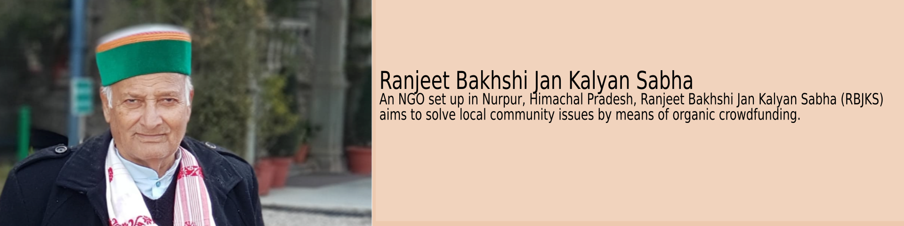

[](https://rbjks.github.io/index.html)

[](https://www.facebook.com/akil.bakhshi/)
[](https://twitter.com/a_bsays)


# [RBJKS NGO](https://rbjks.github.io/index.html)

Welcome to the RBJKS (Ranjeet Bakhshi Jan Kalyan Sabha) NGO Project! Our mission is to address local community issues in Nurpur, Himachal Pradesh, India, through organic crowdfunding initiatives.

## Table of Contents

- [About](#about)
- [Mission](#mission)
- [Get Involved](#get-involved)
- [Preferred Colors](#Preferred-Colors)
- [Steps for contributing](#Steps-for-contributing)
- [Contact Us](#contact-us)

## About

Ranjeet Bakhshi Jan Kalyan Sabha, a distinguished non-profit organization headquartered in Nurpur, Himachal Pradesh, India, is dedicated to social responsibility and sustainable development. We're here to address pressing community issues with the power of grassroots initiatives and collaboration. Together, we're creating lasting impact and positive change for individuals and families in our community.

## Mission

Our NGO is actively involved in various initiatives and crowdfunding campaigns, supporting individuals from lower-economic backgrounds. Through community events, workshops, and resource-sharing, we empower individuals to drive positive change. Together, we aim to build a resilient community where everyone thrives. Join us on this journey towards a brighter, more inclusive future.

## Get Involved

Welcome, wonderful contributor! We're thrilled that you're interested in lending a hand to our project. Here are some simple guidelines to make your contribution process as smooth as possible:

  - **Get Involved:** Dive right in! Look through our list of issues and find one that sparks your interest. Feel free to ask questions or seek clarification if needed.

  - **Claiming Issues:** Once you've found an issue you'd like to tackle, leave a comment to claim it. Our friendly team will then assign it to you.

  - **First-Come, First-Served:** We operate on a first-come, first-served basis. Don't worry if someone else is already working on an issue; there's always room for collaboration!

  - **Creating Issues:** Can't find an issue that matches what you'd like to work on? No problem! Open a new issue and describe your proposal. We'll review it and get back to you.

  - **Respecting Assignments:** Please avoid working on issues that are already assigned to someone else. Let's ensure everyone has the opportunity to contribute.

  - **Submitting Pull Requests:** Once you've completed your changes, submit a pull request. We'll review it with care and provide feedback if necessary.

  - **Learning and Growing:** Remember, we're all here to learn and grow together. Don't hesitate to reach out if you need assistance or guidance along the way.

## Preferred Colors

- **Emerald** (#22B9A8)

  
- **Deep Saffron** (#FF9933)

  
- **Desert Sand** (#EDC9AF)

  


## ▶️ Steps for contributing :

### Fork this repository


<br>
Fork this repository by clicking on the fork button on the top of this page.
This will create a copy of this repository in your account.

### Clone This Repository


Now clone the forked repository to your machine.
Go to your GitHub account, open the forked repository, click on the code button and then click the copy to clipboard icon.

Open a terminal and run the following git command:

```bash
git clone https://github.com/<Your-Github-username>/rbjks.github.io.git
```

### Create a branch

Change to the repository directory on your computer (if you are not already there):

```bash
cd rbjks.github.io
```

Now create a branch using the `git checkout` command:

```bash
git checkout -b <branch-name>
```

For example:

```
git checkout -b add-new-feature
```

### Make necessary changes and commit those changes

If you go to the project directory and execute the command `git status`, you'll see there are changes.

Add those changes to the branch you just created using the git add command:

```bash
git add .
```

Now commit those changes using the git commit command:

```bash
git commit -m "Your commit message"
```

### Push changes to GitHub

Push the changes to the forked repository using:

```bash
git push origin <Your-branch-name>
```

Navigate to the original fork of this repository on your profile and click on the branch you had committed to.
Then click on Contribute to create a Pull Request i.e create a PR on Github. (Don't just hit the create a pull request button, you must write a PR message to clarify why and what are you contributing)

## In case of merge conflict fetch and merge from the remote repository.

If you encounter a merge conflict while working on your branch, you can resolve it by fetching and merging changes from the remote repository. Here's how you can do it:

- [Resolving a merge conflict on GitHub](https://docs.github.com/en/github/collaborating-with-issues-and-pull-requests/resolving-a-merge-conflict-on-github)
- [Fetching changes from a remote repository](https://docs.github.com/en/github/collaborating-with-issues-and-pull-requests/fetching-changes-from-a-remote-repository)
- [Merging changes from a remote repository](https://docs.github.com/en/github/collaborating-with-issues-and-pull-requests/merging-a-pull-request)

## Are you a beginner in using Github?

You can refer to the following articles on the basics of Git and Github and also contact me, in case you are stuck:

- [Forking a Repo](https://help.github.com/en/github/getting-started-with-github/fork-a-repo)
- [Cloning a Repo](https://help.github.com/en/desktop/contributing-to-projects/creating-an-issue-or-pull-request)
- [How to create a Pull Request](https://opensource.com/article/19/7/create-pull-request-github)
- [Getting started with Git and GitHub](https://towardsdatascience.com/getting-started-with-git-and-github-6fcd0f2d4ac6)
- [Learn GitHub from Scratch](https://lab.github.com/githubtraining/introduction-to-github)


Thank you for being a part of our community and for your valuable contributions! Together, we can make amazing things happen. 🌟

## Contact us

  - **Email**: RBJKS.info@gmail.com
  - **GitHub:** [RBJKS GitHub](https://github.com/rbjks)
  - **Address:** PO: Jassur, Tehsil - Nurpur, District - Kangra, HP, 176201.
